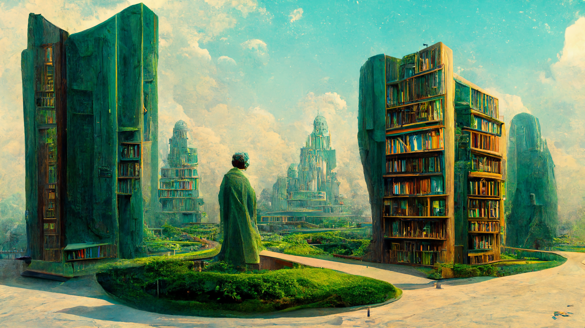

[2022, Designermadsen, Deviantart](https://www.deviantart.com/designermadsen/art/The-infinite-library-Garden-924910668)

# Exam project - Kanban
## Status
|              |
| ------------------------------------------------------------------------------------------------------------------------------------ |
|        |
|  |

## Content
* [Contribute](contributing.md)
* [Code of Conduct](code_of_conduct.md)
* [Documentation](docs/readme.md)
* [License](LICENSE.md)

## Footnotes

### Document details
Author: Kent Madsen

Copyright: 2022, Kent vejrup Madsen

License: [MIT License](https://github.com/KentVejrupMadsen/EASV.Exam.Kanban.Backend/blob/main/license.md)

Contact Information: 
* [Email](mailTo:Kent.vejrup.madsen@designermadsen.dk)
* [Issues](https://github.com/KentVejrupMadsen/EASV.Exam.Kanban.Backend/issues)
* [Phone](tel:+4551902914)
* [Github](https://github.com/KentVejrupMadsen)

Made using: [Template.Project.PHP](https://github.com/KentVejrupMadsen/Template.Project.PHP)

Created at: 2022, 08, 10

Last updated at: 2022, 08, 10
